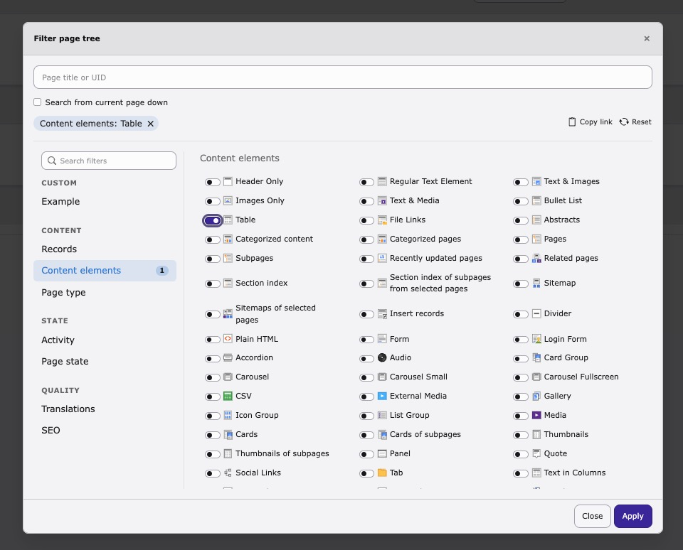
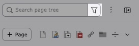
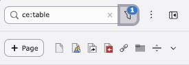

<div align="center">


# TYPO3 extension `pagetree_facets`


[](https://github.com/konradmichalik/typo3-pagetree-facets/actions/workflows/cgl.yml)
[](https://coveralls.io/github/konradmichalik/typo3-pagetree-facets)
[](https://github.com/konradmichalik/typo3-pagetree-facets/actions/workflows/tests.yml)
[](LICENSE.md)

</div>

Type filter tokens into the backend page tree's search field, or press
`Ctrl/Cmd+Shift+F` for a modal, to narrow the tree to matching pages:

```
doktype:1 is:empty                # standard pages without content
table:tx_news_domain_model_news   # pages containing news records
ce:uploads updated:<30d           # pages with an uploads CE, touched last 30 days
seo:missing-description           # indexable pages without meta description
```

Whitespace = AND, comma = OR within one criterion (`doktype:1,4`). Freetext
(no `key:`) behaves like the core title/UID search; unknown tokens are ignored.

> [!WARNING]
> This package is in early development stage and may change significantly in
> the future. I am working steadily to release a stable version as soon as
> possible.

<div align="center">



</div>

| Type a token, or open the modal from the toolbar | The phrase lands back in the search field |
|---|---|
|  |  |

## ✨ Features

- **Filterable page tree**: type tokens into the tree's existing search field, or open a modal (`Ctrl/Cmd+Shift+F`) for a guided UI with active-filter chips and per-tab counts
- **Built-in filter tabs**: Records (`table:` `record:` `text:`), Content elements (`ce:`), Activity (`updated:` `created:` `by:`), Page type (`doktype:`), Page state (`is:`), Translations (`untranslated:`), SEO (`seo:`, requires EXT:seo)
- **Scopes**: `site:<identifier>` narrows to one site, `under:<uid>` to the page currently open and its subpages
- **Extensible tab API**: register a `FilterTabInterface` implementation via `RegisterFilterTabsEvent`; built-in tabs use the exact same path
- **Per-user/group control**: disable tabs globally (extension settings) or per user/group (`tx_pagetreefacets.disableTabs` / `.disable`)

## 🔥 Installation

### Requirements

* TYPO3 ^14.0
* PHP 8.3 - 8.5

### Composer

``` bash
composer require konradmichalik/typo3-pagetree-facets
```

> [!NOTE]
> Not yet released to Packagist or TER; install from a VCS repository until the first tagged release.

## 🔌 Extending

Register a `FilterTabInterface` implementation via `RegisterFilterTabsEvent`
(`#[AsEventListener]`); the built-in tabs use the exact same path. A tab owns
token keys, resolves them to page UIDs, and describes its modal UI declaratively.

## 🙏 Acknowledgments

This project is inspired by the great [pagetreefilter](https://github.com/christophlehmann/pagetreefilter) extension.

## 🧑‍💻 Contributing

Please have a look at [`CONTRIBUTING.md`](CONTRIBUTING.md).

## ⭐ License

This project is licensed under [GNU General Public License 2.0 (or later)](LICENSE.md).
