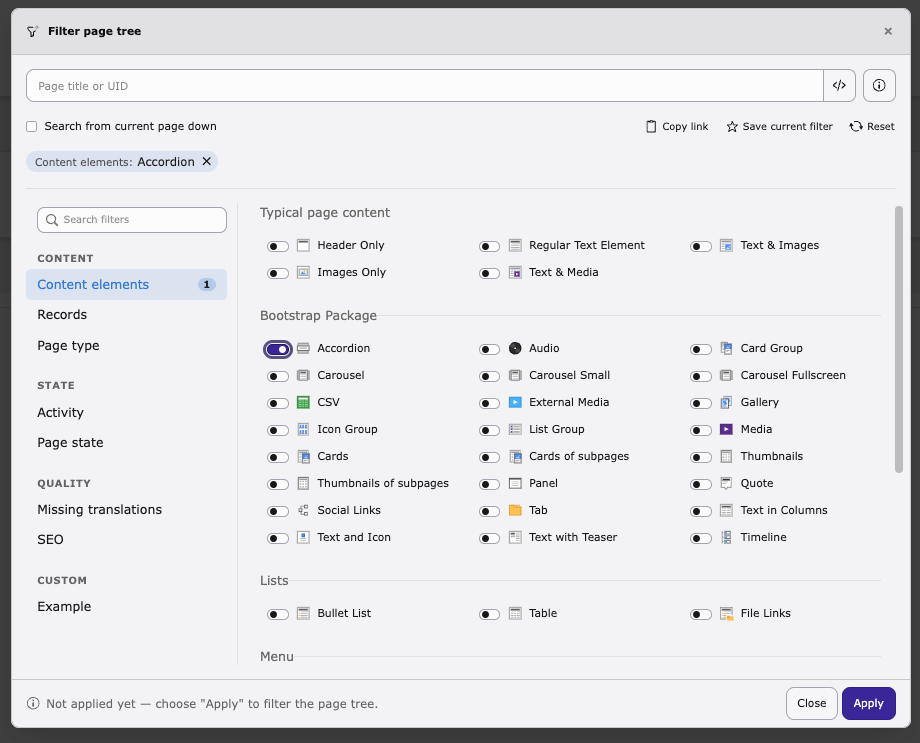
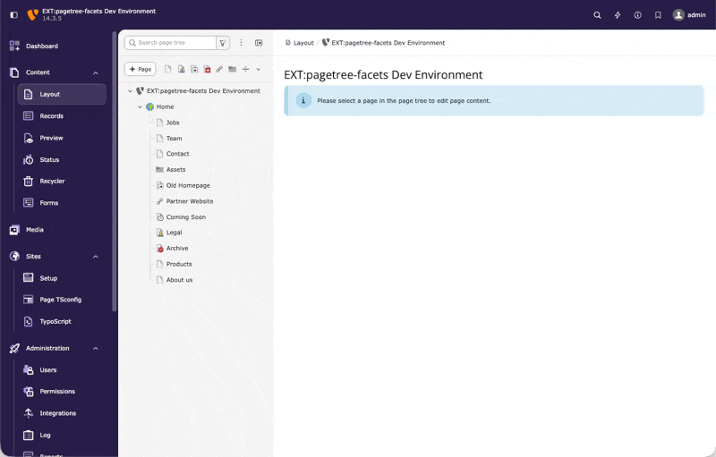

<div align="center">


# TYPO3 extension `typo3_pagetree_facets`

[](https://extensions.typo3.org/extension/typo3_pagetree_facets)


[](https://github.com/konradmichalik/typo3-pagetree-facets/actions/workflows/cgl.yml)
[](https://coveralls.io/github/konradmichalik/typo3-pagetree-facets)
[](https://github.com/konradmichalik/typo3-pagetree-facets/actions/workflows/tests.yml)
[](LICENSE.md)

</div>

This extension turns the TYPO3 backend page tree into a faceted filter. Instead
of scrolling through a large tree, you narrow it down to exactly the pages you
care about: by content type, page state, records, activity, translations or SEO.

Filters are compact tokens that you can type into the tree's existing search
field or assemble in a guided modal, and the whole feature is extensible through
a public facet API.

<div align="center">



</div>

> [!NOTE]
> Ever scrolled an entire page tree looking for the one page with that content
> element on it? Or the handful of empty pages nobody ever cleaned up? The core
> search only matches page titles and UIDs, so it can't answer either question.
> This extension can, right in the same tree you already know.

## ✨ Features

- **Filterable page tree**: type tokens into the tree's search field, or open a guided modal with <kbd>Ctrl</kbd>/<kbd>Cmd</kbd>+<kbd>Shift</kbd>+<kbd>L</kbd>
- **Nine built-in filter facets** (SEO requires EXT:seo, Forms requires EXT:form): content elements, records, activity, page type, layouts, page state, translations, SEO and forms, plus `site:` / `under:` scope tokens
- **Sharable links, session persistence and favorites**: hand a filter to a colleague, keep it across a reload, or save it under a name
- **Live match count**: see how many pages a selection would match before applying, right in the filter modal (opt-out via `livePreviewCount`)
- **Extensible**: add a single option to an existing facet, or a whole facet of your own
- **Per-user/group control**: disable facets installation-wide or via User TSconfig
- **Raw query escape hatch** (`raw:`, opt-in): match arbitrary `field=value` conditions against any TCA table the user may already read

## 🔥 Installation

### Requirements

* TYPO3 ^14.0
* PHP 8.3 - 8.5

### Composer

[](https://packagist.org/packages/konradmichalik/typo3-pagetree-facets)
[](https://packagist.org/packages/konradmichalik/typo3-pagetree-facets)

``` bash
composer require konradmichalik/typo3-pagetree-facets
```

### TER

[](https://extensions.typo3.org/extension/typo3_pagetree_facets)
[](https://extensions.typo3.org/extension/typo3_pagetree_facets)

Download the zip file from [TYPO3 extension repository (TER)](https://extensions.typo3.org/extension/typo3_pagetree_facets).

## 📖 How it works

Press <kbd>Ctrl</kbd>/<kbd>Cmd</kbd>+<kbd>Shift</kbd>+<kbd>L</kbd> (or use the toolbar button next to the tree's search
field) to open the filter modal. Pick criteria by clicking through the facets on
the left; each selection appears as a removable chip above the tree, with a
per-facet count of matching pages, and narrows the tree live as you go.



Prefer typing? The **Token view** toggle (top bar) swaps the freetext field for the
full filter phrase, kept in two-way sync with the form: edit either side and the
other follows. Note that editing the form re-serialises the phrase, so tokens the
form cannot represent survive only while you stay in the field.

Under the hood, every filter is a compact token that lands in the tree's
existing search field, so you can also skip the modal and type directly:

```
doktype:1 is:empty                # standard pages without content
table:tx_news_domain_model_news   # pages containing news records
ce:uploads updated:<30d           # pages with an uploads CE, touched last 30 days
seo:missing-description           # indexable pages without meta description
```

Whitespace means AND, a comma means OR within one criterion (`doktype:1,4`).
Freetext without a `key:` prefix behaves like the core title/UID search, and
unknown tokens are ignored.

Every built-in facet and the token keys it owns:

| Facet | Token keys | Filters by |
|---|---|---|
| Content elements | `ce:` | the CType of content elements on the page |
| Records | `table:` `record:` `text:` | any other record referencing the page |
| Activity | `updated:` `created:` `by:` `createdby:` | when the page changed and who touched it |
| Page type | `doktype:` | the page's doktype |
| Layouts | `layout:` `pagelayout:` | the backend/frontend layout assigned to the page |
| Page state | `is:` | flags such as hidden, empty or editlocked |
| Translations | `untranslated:` `translated:` | translation completeness |
| Forms (requires EXT:form) | `form:` | which TYPO3 Form Framework form is embedded on the page |
| SEO (requires EXT:seo) | `seo:` | SEO metadata issues, e.g. a missing description |
| Raw query (opt-in, see [Configuration](Documentation/CONFIGURATION.md)) | `raw:` | arbitrary `field=value` conditions on any TCA table |

`site:<identifier>` and `under:<uid>` are not facets: they are special scope
tokens that restrict any of the above to one site or subtree.

Need a criterion that isn't listed? Third parties can register their own facet,
or add a value to an existing one; see [Extending](Documentation/EXTENDING.md).

> [!IMPORTANT]
> Every criterion resolves to **pages**, whatever it matches on. `ce:uploads` or
> `table:tx_news_domain_model_news` do not list content elements or news records;
> they narrow the tree to the pages those records live on. The result of a filter
> is always a set of pages.

<!-- -->

> [!NOTE]
> This is not the global backend search (the toolbar magnifier / <kbd>Cmd</kbd>/<kbd>Ctrl</kbd>+<kbd>K</kbd>).
> That one finds individual records, pages and modules and jumps you to them; this
> extension narrows the **page tree** to the pages matching structured criteria.
> Two different jobs: use the toolbar search to locate one thing, this to reshape
> the tree.

## 📚 Documentation

| Topic | What's inside |
|---|---|
| [Configuration](Documentation/CONFIGURATION.md) | Extension settings, the `raw:` power-user token, and per-user/group control via User TSconfig |
| [Known Limitations](Documentation/LIMITATIONS.md) | Scopes as a post-filter, layout inheritance, page permissions, and freetext-with-token search behaviour |
| [Extending](Documentation/EXTENDING.md) | The two extension points, the `example_tab` fixture, and the public API / stability promise |

## 🙏 Acknowledgments

This project is inspired by the great [pagetreefilter](https://github.com/christophlehmann/pagetreefilter) extension.

## 🧑‍💻 Contributing

Please have a look at [`CONTRIBUTING.md`](CONTRIBUTING.md).

## ⭐ License

This project is licensed under [GNU General Public License 2.0 (or later)](LICENSE.md).
